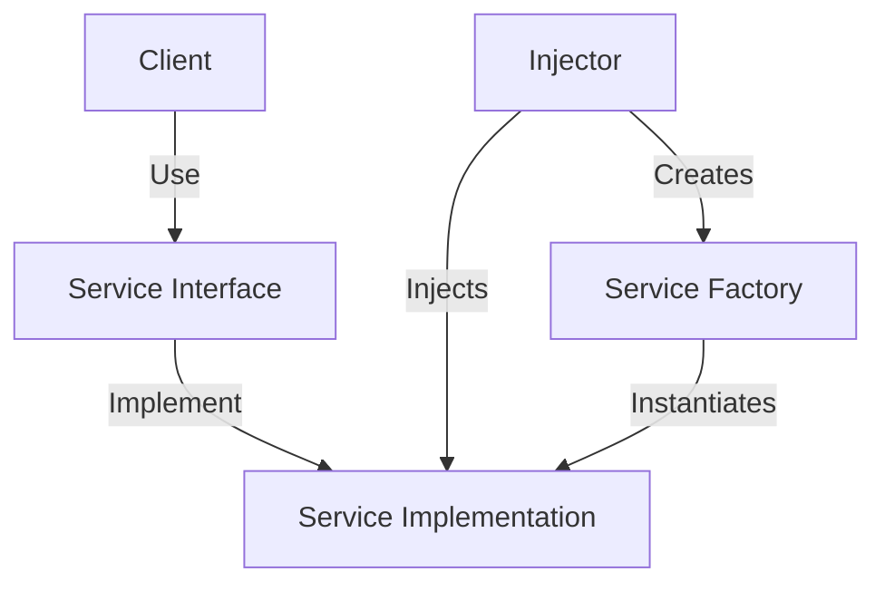
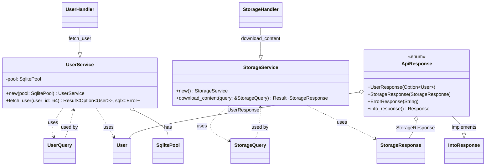
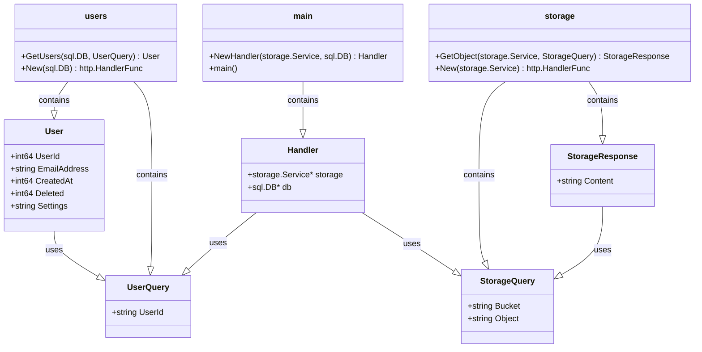

[Rust Advent Calendar 2023](https://qiita.com/advent-calendar/2023/rust) の投稿です。

https://qiita.com/advent-calendar/2023/rust

自己紹介です。現職は、小売の買い物体験向上に取り組む Software Engineer です。

この投稿では、本業（SRE）のかたわらで取り組む Backend について書きます。

題材は、Rust 初心者として考える Production Code です。

Production Code において、`main.rs`[^6] だけで構成することは、通常ないと思います。

従って、Architecture が必要です。

ここ数年、DDD[^1] や Clean Architecture[^2] など、色々な設計手法が話題です。
僕個人の意見として、Architecture は、テスト可能なコードであれば良いと思います。
最低限、自動テストを可能にするには、抽象化が必要になります。



例えば、Database や 外部 API など、state を持つ外部関係を抽象化できれば、Domain Logic は繰り返しテスト可能になります。

今回、それを実現する方法の1つである Dependency Injection（DI）[^3] の実装について書いていきます。

ご存知の通り、DI を用いることで、低水準のコンポーネント（例えば Database Access）の Domain logic の単体テストが容易になります。

## tl;dr
* 個人的な意見ですが、Go は冗長に見えて誰が見ても分かりやすい。
* Rust は簡潔であり Compileで安全性を担保してくれる。
* Rust の `match` 構文は Coding 体験として素晴らしいと思いました。


さらに詳しく見たい方は読み続けてください。

---

「Go ではこう書く」「Rust ではこう書く」という感じで比較します。

コードはこちらです。

https://github.com/danny-yamamoto/rust-api-samples/tree/main/main

https://github.com/danny-yamamoto/go-api-samples

## Implementing Dependency Inversion(DI) in Rust



Rust での実装の手順です。
DI を実装する前段階として、`/users` と `/storage` という API を用意しました。
* `/users`: Database（SQLite[^5]）から指定した user の情報を取得する API です。
* `/storage`: Cloud Storage[^4] から指定した Ojbect を取得する API です。

この2つの API に DI を実装します。
1. `/users` と `/storage` に関する操作をそれぞれのモジュールに分ける。
1. handler を変更する。handler でサービスを使用する。
1. 呼び出し側（endpoint、この場合は `main.rs`）でサービスを注入する。

:::message
ポイントは、ApiResponse `enum` 列挙型の `/users` のレスポンス、`/storage` のレスポンス、およびエラーのレスポンスの 3 種類のバリアントです。異なるタイプのレスポンスを柔軟に扱うことが出来ます。
:::

これで、`fetch_user` `download_content` 単体でテストが可能になります。

https://github.com/danny-yamamoto/rust-api-samples/blob/main/main/src/routes.rs

```diff
use std::sync::Arc;
use axum::Json;
use axum::http::StatusCode;
use axum::response::IntoResponse;
use axum::{Extension, extract::Query};
use cloud_storage::Client;
use sqlx::SqlitePool;
use model::UserQuery;

use crate::model::{StorageQuery, User, self, StorageResponse};

pub enum ApiResponse {
    UserResponse(Option<User>),
    StorageResponse(StorageResponse),
    ErrorResponse(String),
}

use axum::response::Response;

impl IntoResponse for ApiResponse {
    fn into_response(self) -> Response {
        match self {
            ApiResponse::UserResponse(user) => (StatusCode::OK, Json(user)).into_response(),
            ApiResponse::StorageResponse(storage) => (StatusCode::OK, Json(storage)).into_response(),
            ApiResponse::ErrorResponse(err) => (StatusCode::INTERNAL_SERVER_ERROR, Json(err)).into_response(),
        }
    }
}

- pub async fn user_handler(Query(query):Query<UserQuery>, Extension(pool):Extension<Arc<SqlitePool>>) -> impl IntoResponse {
-    let selected = query.user_id;
-    match sqlx::query_as!(User, "select user_id, email_address, created_at, deleted, settings from users where user_id = ?", selected).fetch_optional(&*pool).await {
-        Ok(user) => ApiResponse::UserResponse(user),
-        Err(_) => ApiResponse::ErrorResponse("Internal Server Error".to_string()),
-    }
- }
+ pub async fn user_handler(Query(query):Query<UserQuery>, Extension(user_service):Extension<Arc<UserService>>) -> impl IntoResponse {
+    match user_service.fetch_user(query.user_id).await {
+        Ok(user) => ApiResponse::UserResponse(user),
+        Err(_) => ApiResponse::ErrorResponse("Internal Server Error".to_string()),
+    }
+ }

- pub async fn storage_handler(Query(query):Query<StorageQuery>) -> impl IntoResponse {
-    let client = Client::default();
-    match client.object().download(&query.bucket, &query.object).await {
-        Ok(bytes) => ApiResponse::StorageResponse(StorageResponse { content: String::from_utf8_lossy(&bytes).to_string() }),
-        Err(error) => ApiResponse::ErrorResponse(error.to_string()),
-    }
- }
+ pub async fn storage_handler(Query(query):Query<StorageQuery>, Extension(storage_service):Extension<Arc<StorageService>>) -> impl IntoResponse {
+    match storage_service.download_content(&query).await {
+        Ok(content) => ApiResponse::StorageResponse(content),
+        Err(error) => ApiResponse::ErrorResponse(error.to_string()),
+    }
+ }

+ pub struct UserService {
+    pool: SqlitePool,
+ }
+
+ impl UserService {
+    pub fn new(pool: SqlitePool) -> Self {
+        UserService { pool }
+    }
+
+    pub async fn fetch_user(&self, user_id: i64) -> Result<Option<User>, sqlx::Error> {
+        sqlx::query_as!(User, "SELECT user_id, email_address, created_at, deleted, settings FROM users WHERE user_id = ?", user_id).fetch_optional(&self.pool).await
+    }
+ }
+
+ pub struct StorageService;
+
+ impl StorageService {
+    pub fn new() -> Self {
+        StorageService {}
+    }
+
+    pub async fn download_content(&self, query: &StorageQuery) -> Result<StorageResponse, String> {
+        let client = Client::default();
+        match client.object().download(&query.bucket, &query.object).await {
+            Ok(bytes) => Ok(StorageResponse { content: String::from_utf8_lossy(&bytes).to_string() }),
+            Err(error) => Err(error.to_string()),
+        }
+    }
+ }
```

## Rust to Go Conversion



Rust で実装した内容と同じものを Go で実装します。
1. `New` 関数を追加する。
1. Handler 構造体及び NewHandler 関数を削除する。

この変更で Domain Logic を実装する `GetUsers` 関数の Test Code を実装できます。

https://github.com/danny-yamamoto/go-api-samples/blob/main/internal/users/users.go

```diff
-type Handler struct {
-	db *sql.DB
-}
-
-func NewHandler(db *sql.DB) *Handler {
-	return &Handler{db: db}
-}
-
-func respondWithJSON(w http.ResponseWriter, statusCode int, payload interface{}) {
-	response, _ := json.Marshal(payload)
-	w.Header().Add("Content-Type", "application/json")
-	w.WriteHeader(statusCode)
-	w.Write(response)
-}
-
-func (h Handler) UserHandler(w http.ResponseWriter, r *http.Request) {
-	userId := r.URL.Query().Get("user_id")
-	var user User
-	err := h.db.QueryRow("select * from users where user_id = ?", userId).Scan(&user.UserId, &user.EmailAddress, &user.CreatedAt, &user.Deleted, &user.Settings)
-	if err != nil {
-		fmt.Println(err)
-		respondWithJSON(w, http.StatusInternalServerError, err)
-		return
-	}
-	respondWithJSON(w, http.StatusOK, user)
-}
-
+type UserQuery struct {
+	UserId string `json:"user_id"`
 }

+func GetUsers(db *sql.DB, query UserQuery) (*User, error) {
+	userId := query.UserId
+	var user User
+	err := db.QueryRow("select * from users where user_id = ?", userId).Scan(&user.UserId, &user.EmailAddress, &user.CreatedAt, &user.Deleted, &user.Settings)
+	if err != nil {
+		log.Printf("Query Error: %s", err)
+		return nil, err
+	}
+	return &user, nil
+}
+
+// Factory Function
+func New(db *sql.DB) http.HandlerFunc {
+	return func(w http.ResponseWriter, r *http.Request) {
+		query := UserQuery{UserId: r.URL.Query().Get("user_id")}
+		data, err := GetUsers(db, query)
+		if err != nil {
+			http.Error(w, err.Error(), http.StatusInternalServerError)
+			return
+		}
+		json.NewEncoder(w).Encode(data)
+	}
+}
```

簡単ですが、DI については以上です。

この投稿をみて何か得られた方は、いいね ❤️ をお願いします。

それでは、次回のアドカレでお会いしましょう。👋

## BTW
現職の [Retail AI](https://www.retail-ai.jp) は、[トライアルカンパニー](https://www.trial-net.co.jp) を軸とした小売におけるお客様の買い物体験の向上を目指す企業です。

[アドカレ](https://qiita.com/advent-calendar/2023/rai-adventurers)も絶賛開催中です。

https://qiita.com/advent-calendar/2023/rai-adventurers

### Rocket v0.5
Rust の HTTP Server Crate[^8] は、Axum[^7] 以外にもいくつか選択肢があります。

例えば、`Rocket` も気になります。

https://rocket.rs/v0.5/news/2023-11-17-version-0.5/

https://tokio.rs/blog/2023-11-27-announcing-axum-0-7-0

常に現状を打破して改善したいという人間の欲求と technology の進化を見ていると、ワクワクします。

[^1]: ドメイン駆動設計とは、ドメインの専門家からの入力に従ってドメインに一致するようにソフトウェアをモデル化することに焦点を当てるソフトウェア設計手法である。
[^2]: Clean Architectureは、ソフトウェア開発における設計原則の一つで、ソフトウェアの設計を整理し、メンテナンス性、拡張性、テスト容易性を高めることを目的としています。このアーキテクチャは、ロバート・C・マーティン（通称「アンクル・ボブ」）によって提唱されました。
[^3]: ソフトウェア設計の原則の一つで、SOLIDの原則の一部です。
[^4]: 非構造化データを保存するための Google Cloud のマネージド サービスです。保存できるデータ量に制限はなく、保存したデータを必要に応じて何度でも取得できます。 
[^5]: 非常に軽量で簡易的なデータベースです。
[^6]: Rust プログラムの Entry Point です。`main` 関数がプログラムの開始点です。通常、この `main` 関数は `main.rs` 内に定義されます。
[^7]: https://docs.rs/axum/latest/axum/
[^8]: Rust のコード（関数、構造体、モジュールなど）の集まりであり、再利用可能なライブラリや実行可能なプログラムを構築するために使用されます。
