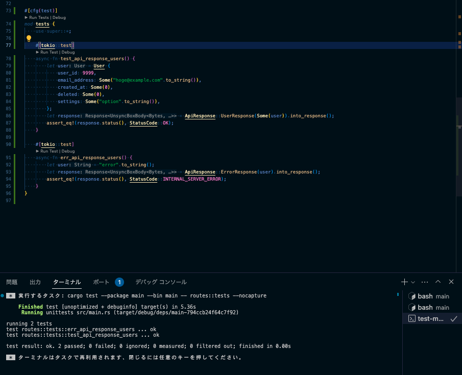

Rust 初心者として、Production 用のフォルダ・ファイルの構成を考える。

これを書いている時点の課題は、構造体や handler を別ファイルに分けた場合の参照方法。

microservices を実装するには、分割が必要。`main.rs` は entorypoint として、controller や routes、service などに分ける。

それと、Rust のテスト手法。

pool や client を抽象化して、test code を実装できる形に変える。依存関係の逆転を取り入れる。

LeetCode の Graph, BFS, DFS を見ていると、algorithm に特化した学習が必要かもしれない。

「Rust できます」と言えるまでにはもう少し時間がかかりそう。

## How to write tests
テストの書き方について。

Unit tests と Integration tests の 2つある。

### Unit tests
logic 内に書く。
test code であることを明示するために、annotation を付与する。

> Unit Tests
The purpose of unit tests is to test each unit of code in isolation from the rest of the code to quickly pinpoint where code is and isn’t working as expected. You’ll put unit tests in the src directory in each file with the code that they’re testing. The convention is to create a module named tests in each file to contain the test functions and to annotate the module with cfg(test).

https://doc.rust-lang.org/book/ch11-03-test-organization.html?highlight=cfg(test)#unit-tests

公式の docs の通り、`cfg(test)` を付与するのが慣例ということ。

試しに unit tests を書く。

```rust:routes.rs
#[cfg(test)]
mod tests {
    use super::*;

    #[tokio::test]
    async fn test_api_response_users() {
        let user = User {
            user_id: 9999,
            email_address: Some("hoge@example.com".to_string()),
            created_at: Some(0),
            deleted: Some(0),
            settings: Some("option".to_string()),
        };
        let response = ApiResponse::UserResponse(Some(user)).into_response();
        assert_eq!(response.status(), StatusCode::OK);
    }
}
```

テストを実行する
```bash
vscode ➜ /workspaces/rust-api-samples/main (main) $ cargo test
    Finished test [unoptimized + debuginfo] target(s) in 2.66s
     Running unittests src/main.rs (target/debug/deps/main-794ccb24f64c7f92)

running 1 test
test routes::tests::test_api_response_users ... ok

test result: ok. 1 passed; 0 failed; 0 ignored; 0 measured; 0 filtered out; finished in 0.00s

vscode ➜ /workspaces/rust-api-samples/main (main) $ 
```

VS Code の画面からちょっせつ実行できる。


## Rust Web Server
実装の手順
1. 

## Rust to Go Conversion
実装の手順
1. 
